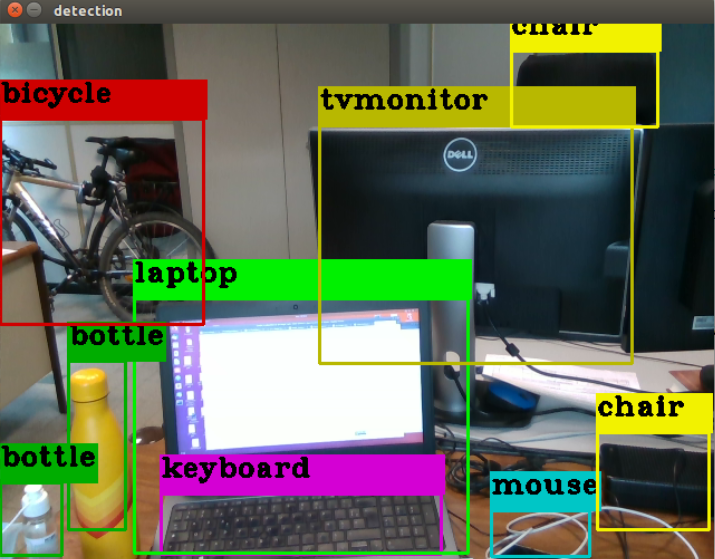

# ROS Yolo Object Detection #

Simple object detection with [YOLOv4](https://github.com/AlexeyAB/darknet) in C++ on ROS.



## Citing ##

YOLOv4 paper: "[YOLOv4: Optimal Speed and Accuracy of Object Detection](https://arxiv.org/abs/2004.10934)"

## Building ##

First install darknet to use the YOLOv4 object detector using `make` in the darknet repository.
In the `Makefile` set:

- `GPU=1` to build enabling CUDA support (OPTIONAL)
- `OPENCV=1` to build with OpenCV
- `LIBSO=1` to build the library `darknet.so`

Once darknet installed just go to your catkin workspace root directory and build using `catkin_make`.

## Usage ##

Set the correct camera topic name in the launch file `yolo_object_detection.launch` in the `launch`folder and start with

```
$ roslaunch yolo_object_detection yolo_object_detection.launch
``̀

